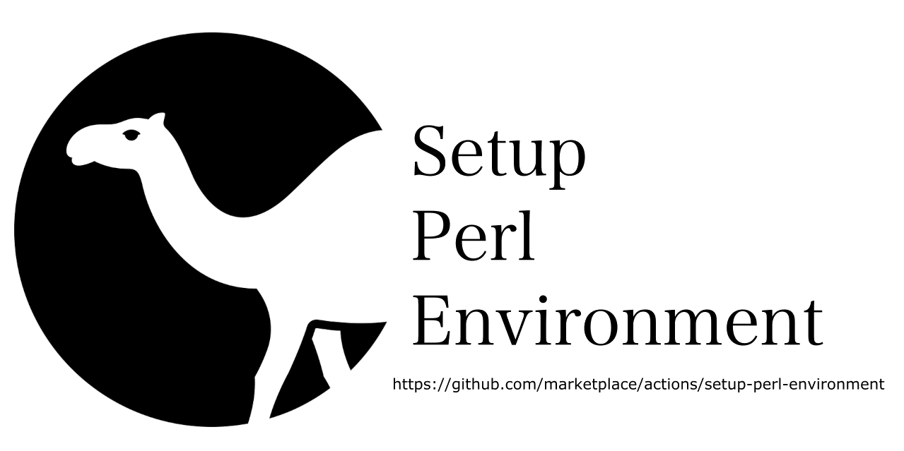

# actions-setup-perl

[](https://github.com/shogo82148/actions-setup-perl/actions/workflows/test.yml)



This action sets by perl environment for use in actions by:

- optionally downloading and caching a version of perl
- registering problem matchers for error output 

# Usage

See [action.yml](action.yml)

Basic:
```yaml
steps:
- uses: actions/checkout@v3
- uses: shogo82148/actions-setup-perl@v1
  with:
    perl-version: '5.34'
- run: cpanm --installdeps .
- run: prove -lv t
```

Install CPAN Modules from cpanfile and cache them:
```yaml
steps:
- uses: actions/checkout@v3
- uses: shogo82148/actions-setup-perl@v1
  with:
    perl-version: '5.34'
    install-modules-with: cpanm
    install-modules-args: --with-develop --with-configure
- run: prove -lv t
```

Matrix Testing:
```yaml
jobs:
  build:
    runs-on: ${{ matrix.os }}
    strategy:
      matrix:
        os: ['ubuntu-latest', 'macos-latest', 'windows-latest']
        perl: [ '5.34', '5.32', '5.30' ]
    name: Perl ${{ matrix.perl }} on ${{ matrix.os }}
    steps:
      - uses: actions/checkout@v3
      - name: Set up perl
        uses: shogo82148/actions-setup-perl@v1
        with:
          perl-version: ${{ matrix.perl }}
      - run: perl -V
      - run: cpanm --installdeps .
      - run: prove -lv t
```

## Use Strawberry Perl on Windows

actions-setup-perl uses the binaries customized for GitHub Actions by default.
If you want to use [Strawberry Perl](http://strawberryperl.com/) on Windows, add `distribution: strawberry` into the "with" section.

```yaml
steps:
- uses: actions/checkout@v3
- uses: shogo82148/actions-setup-perl@v1
  with:
    perl-version: '5.32'
    distribution: strawberry
- run: cpanm --installdeps .
- run: prove -lv t
```

This option is available on Windows and falls back to the default customized binaries on other platforms.

### Supported Platforms

The action works for [GitHub-hosted runners](https://docs.github.com/en/actions/using-github-hosted-runners/about-github-hosted-runners).

| Operating System | Supported Versions |
| --- | --- |
| Linux | `ubuntu-20.04`, `ubuntu-22.04` |
| macOS | `macos-11`, `macos-12` |
| Windows | `windows-2019`, `windows-2022` |

[Self-hosted runners](https://docs.github.com/en/actions/hosting-your-own-runners) are not supported.

## Action inputs

All inputs are **optional**. If not set, sensible defaults will be used.

### `perl-version`

Specifies the Perl version to setup.
Minor version and patch level can be omitted.
The action uses the latest Perl version available that matches the specified value.
This defaults to `5`, which results in the latest available version of Perl 5.
In addition, the value `latest` is available, the actions uses the latest available version of Perl including `5`, `7` or later major versions.

- Default: `5`

### `distribution`

Specify the distribution to use, this is either `default` or `strawberry`. (The value `strawberry` is ignored on anything but Windows.)

- Default: `default`

### `multi-thread`

Enables interpreter-based threads (ithread) options (`-Duseithreads`). `true` and `false` are accepted.

- Default: depends on platform. On Linux and macOS, the default value is "false" (ithread is disabled). On Windows, the default value is "true" (ithread is enable) for fork emulation.

### `install-modules-with`

Install CPAN modules from your `cpanfile` with the specified installer.
`cpanm`([App::cpanminus](https://metacpan.org/pod/App::cpanminus)), `cpm`([App::cpm](https://metacpan.org/pod/App::cpm)), and `carton`([Carton](https://metacpan.org/pod/Carton)) are available.
CPAN modules is installed into `${working-directory}/local/`.

- Default: Nothing. Any CPAN module is not installed.

### `install-modules-args`

The argument for CPAN module installer.

- Default: Nothing

### `install-modules`

List of one or more CPAN modules, separated by white spaces (space or new line).
They are installed `local` directory on your working directory.

- Default: Nothing

### `enable-modules-cache`

Enable caching when install CPAN modules. `true` enables cache and `false` disable it.
The key of cache will generated by the hash of `cpanfile` in the repository root.
Modules in the `local` directory are cached in the end of the job.

- Default: `true`

### `working-directory`

The working directory.

- Default: `.`

## Action outputs

### `perl-version`

The perl version actually installed. (e.g. `"5.34.0"`)

### `perl-hash`

The digest of `perl -V`.
It is useful for the cache key, because this value vary the platform, the version of perl, the compiler option for building perl, etc.

# Supported Shells

The GitHub runner come with a preinstalled version of Perl, used by the system Git. Unfortunately, some shell types prepend the directory containing the system Perl to the `PATH` which makes it impossible to use the Perl installed by this action.

`shell` parameter | Linux | macOS | Windows (default) | Windows (Strawberry)
--- | --- | --- | --- | ---
`bash` | :heavy_check_mark: | :heavy_check_mark: | :x:<sup>1)</sup> | :x:<sup>1)</sup>
`pwsh` | :heavy_check_mark: | :heavy_check_mark: | :heavy_check_mark: | :heavy_check_mark:
`python` | :heavy_check_mark: | :heavy_check_mark: | :heavy_check_mark: | :heavy_check_mark:
`sh` | :heavy_check_mark: | :heavy_check_mark: | n/a | n/a
`cmd` | n/a | n/a | :heavy_check_mark: | :heavy_check_mark:
`powershell` | n/a |  n/a | :heavy_check_mark: | :heavy_check_mark:
custom shell `perl {0}` | :heavy_check_mark: | :heavy_check_mark: | :heavy_check_mark: | :heavy_check_mark:

1) On Windows, the bash shell always gets `/usr/bin` prepended to the `PATH` which contains the system Perl.

# Pre-installed Scripts

The following Perl scripts are pre-installed for convenience.

- [carton](https://metacpan.org/pod/distribution/Carton/script/carton)
- [cpanm](https://metacpan.org/pod/distribution/App-cpanminus/bin/cpanm)
- [cpm](https://metacpan.org/pod/distribution/App-cpm/script/cpm)

# Pre-installed Modules

## CPAN Modules

- [JSON](https://metacpan.org/pod/JSON)
- [Cpanel::JSON::XS](https://metacpan.org/pod/Cpanel::JSON::XS)
- [JSON::XS](https://metacpan.org/pod/JSON::XS)
- [JSON::MaybeXS](https://metacpan.org/pod/JSON::MaybeXS)
- [YAML](https://metacpan.org/dist/YAML/view/lib/YAML.pod)
- [YAML::Tiny](https://metacpan.org/pod/YAML::Tiny)
- [YAML::XS](https://metacpan.org/pod/YAML::XS)
- [Net::SSLeay](https://metacpan.org/dist/Net-SSLeay/view/lib/Net/SSLeay.pod)
- [IO::Socket::SSL](https://metacpan.org/dist/IO-Socket-SSL/view/lib/IO/Socket/SSL.pod)
- [Mozilla::CA](https://metacpan.org/pod/Mozilla::CA)
- [Win32](https://metacpan.org/pod/Win32) (installed from CPAN in perl 5.8.3 or earlier. From perl 5.8.4, it is installed as a core module.)

## Actions::Core

Perl port of [@actions/core](https://github.com/actions/toolkit/tree/main/packages/core).

### SYNOPSIS
```perl
use Actions::Core;

# Inputs/Outputs
my $input = get_input('inputName', { required: true });
my $boolean_input = get_boolean_input('boolean-input'); # accepts YAML 1.2 boolean values.
set_output('outputKey', 'outputVal');

# Exporting variables
export_variable('envVar', 'Val');

# Setting a secret
set_secret('myPassword');

# PATH Manipulation
add_path('/path/to/mytool');

# Exit codes
set_failed(`Action failed with error ${err}`);

# Logging
debug('debug message');
if (is_debug()) {
  # print verbose log
}
info('Output to the actions build log');

# Annotation
error('error')
warning('warning');
notice('notice');
notice('add an annotation to files', {
  title => 'Title',
  file => 'filename.txt',
  start_line   => 1,
  end_line     => 1,
  start_column => 1,
  end_column   => 10,
});

# Manually wrap output
start_group('Do some function');
do_some_function();
end_group();

# Wrap Subroutines
my $result = group 'Do something async' => sub {
  return 'some results';
};

# Custom Functions of actions-setup-perl
# List Available Perl Versions
my @available_perls_on_current_platform = perl_versions(); # ('5.34.0', '5.32.1', '5.30.3', '5.28.3', ...)
my @available_perls_on_linux   = perl_versions(platform => 'linux');
my @available_perls_on_darwin  = perl_versions(platform => 'darwin');
my @available_perls_on_win32   = perl_versions(platform => 'win32');
my @available_strawberry_perls = perl_versions(platform => 'win32', distribution => 'strawberry');
my @including_patch_versions   = perl_versions(patch => 1); # ('5.34.0', '5.32.1', '5.32.0', '5.30.3', '5.30.2', ...)
```

### List Available Perl Versions

Example matrix workflow of using `perl_versions`:

```yaml
jobs:
  list:
    name: list available perl versions
    runs-on: ubuntu-latest
    steps:
      - uses: shogo82148/actions-setup-perl@v1
      - id: set-matrix
        name: list available perl versions
        shell: perl {0}
        run: |
          use Actions::Core;
          set_output(matrix => {perl => [perl_versions()]});
    outputs:
      matrix: ${{ steps.set-matrix.outputs.matrix }}

  run:
    runs-on: ubuntu-latest
    needs: list
    strategy:
      fail-fast: false
      matrix: ${{fromJson(needs.list.outputs.matrix)}}
    steps:
      - uses: shogo82148/actions-setup-perl@v1
        with:
          perl-version: ${{ matrix.perl }}
      # do something
```

# Known Issues

- On Windows, `shell: bash` steps continue to use the system perl [#328](https://github.com/shogo82148/actions-setup-perl/issues/328)

# License

The scripts and documentation in this project are released under the [MIT License](LICENSE.md)

The Raptor in `social-preview.svg` is licensed under the CC-SA License, Version 4.0 [https://creativecommons.org/licenses/by-sa/4.0/](https://creativecommons.org/licenses/by-sa/4.0/). Copyright (C) 2012, Sebastian Riedel.
https://github.com/kraih/perl-raptor
